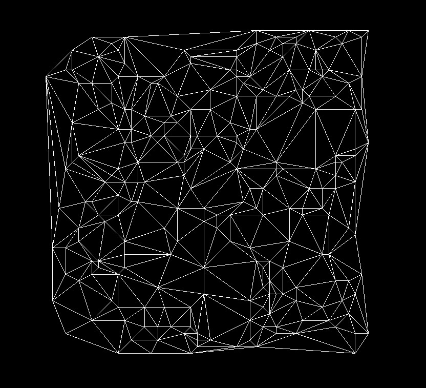

<h1>Delaunay</h1>

A simple implementation of the Bowyer-Watson algorithm for computing the Delaunay triangulation of a set of points in the plane.

<f1>Delaunay triangulation of random set of points</f1>